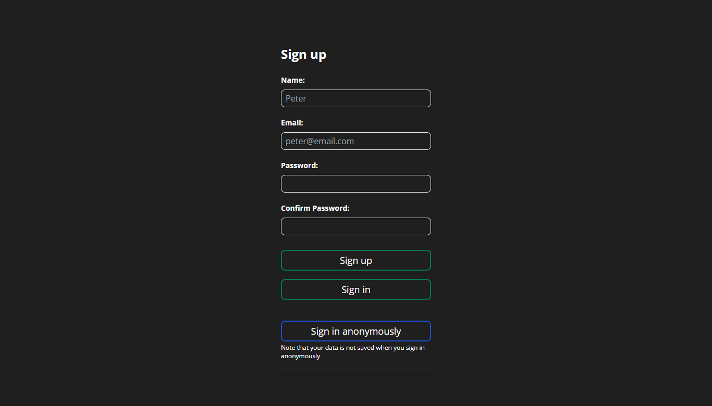

# Tasks
This is a todo web app made with react to practice using redux, typescript and firebase.

[View Live Demo](https://peter-abah.github.io/tasks)

## Features
- Users can sign up with email and password or sign in anonymously
- Users can create projects to group tasks
- Users can edit or delete projects
- Users can add tasks with title, desctiption, priority and due date
- Users can view tasks under a project
- Users can view all tasks
- Users can complete, edit and delete tasks
- User data is saved to firebase firestore

## Screenshots

## Built with
- React
- Redux
- Typescript
- Firebase
- Tailwindcss